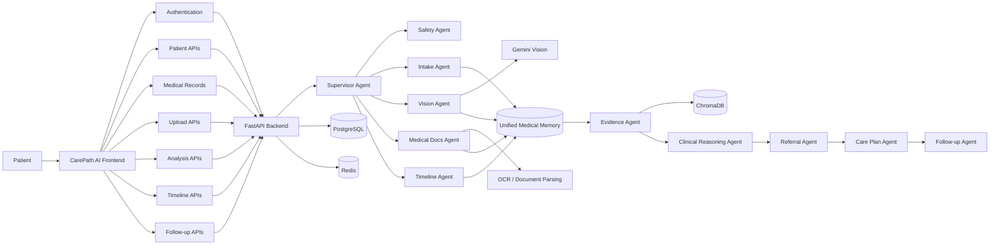

::: {align="center"}
# 💜 CarePath AI

### **Right Guidance. Right Specialist. Right Time.**

```{=html}
<p>
```
`<b>`{=html}Autonomous Healthcare Navigation System`</b>`{=html}
```{=html}
</p>
```
[](https://react.dev/)
[](https://www.typescriptlang.org/)
[](https://vite.dev/)
[](https://fastapi.tiangolo.com/)
[](https://www.postgresql.org/)
[](https://www.trychroma.com/)
[](https://deepmind.google/technologies/gemini/)
:::

```{=html}
<p align="center">
```
`<a href="#overview">`{=html}Overview`</a>`{=html} ·
`<a href="#key-features">`{=html}Key Features`</a>`{=html} ·
`<a href="#technology-stack">`{=html}Tech Stack`</a>`{=html} ·
`<a href="#architecture">`{=html}Architecture`</a>`{=html} ·
`<a href="#ai-agent-architecture">`{=html}AI Agents`</a>`{=html} ·
`<a href="#product-workflow">`{=html}Product Workflow`</a>`{=html} ·
`<a href="#getting-started">`{=html}Getting Started`</a>`{=html}
```{=html}
</p>
```

------------------------------------------------------------------------

`<a id="overview">`{=html}`</a>`{=html}

## 🩺 Overview

**CarePath AI** is an autonomous, multi-agent healthcare navigation
system designed to reduce **diagnostic delay** and help patients move
through the healthcare system with clearer, more informed next steps.

Instead of acting as another medical chatbot, CarePath AI builds a
**living map of a patient's healthcare journey** by bringing together
symptoms, medical images, laboratory reports, prescriptions, treatment
history, follow-up information, and clinical evidence.

Specialized AI agents understand patient inputs, analyze medical
documents and images, construct a longitudinal timeline, retrieve
supporting medical evidence, reason over the collected context, and
recommend an appropriate specialist and next steps.

> **CarePath AI does not replace doctors or provide a medical diagnosis.
> It provides healthcare navigation and decision-support assistance.**

------------------------------------------------------------------------

## 🌟 The Problem

Patients with unresolved symptoms can experience a fragmented journey:

``` text
Symptoms → Consultation → Tests → Treatment
                              ↓
                       Little improvement
                              ↓
                    More consultations/tests
                              ↓
                     Delayed specialist care
```

Important information can become scattered across prescriptions,
reports, images, consultations, and follow-up notes.

**CarePath AI connects these pieces into one intelligent care pathway.**

------------------------------------------------------------------------

`<a id="key-features">`{=html}`</a>`{=html}

## ✨ Key Features

  -----------------------------------------------------------------------
  Capability                          What it enables
  ----------------------------------- -----------------------------------
  **Autonomous Healthcare             Coordinates specialized agents to
  Navigation**                        understand patient context and
                                      determine the next appropriate care
                                      step.

  **Symptom & History Intake**        Structures symptoms, duration,
                                      severity, aggravating factors, and
                                      patient context.

  **Medical Image Analysis**          Processes supported medical images
                                      through the Vision Agent.

  **Medical Document Intelligence**   Parses reports, prescriptions, lab
                                      values, and clinical documents.

  **Unified Medical Memory**          Maintains longitudinal context
                                      across symptoms, treatments,
                                      records, and healthcare events.

  **Clinical Timeline**               Converts scattered medical events
                                      into a chronological care journey.

  **Evidence-backed Reasoning**       Retrieves relevant clinical
                                      evidence and guideline information
                                      through the Evidence/RAG layer.

  **Specialist Recommendation**       Recommends an appropriate medical
                                      specialty and triage priority.

  **Explainable Recommendations**     Shows clinical factors and
                                      supporting evidence behind
                                      recommendations.

  **Care Plan Guidance**              Converts reasoning outcomes into
                                      actionable care-path steps.

  **Doctor Bridge**                   Helps patients prepare clinical
                                      briefs and discussion questions
                                      before appointments.

  **Medication Tracking**             Tracks active medication courses,
                                      dose logs, schedules, and
                                      adherence.

  **Follow-up Monitoring**            Records recovery check-ins and
                                      monitors symptom progression.

  **Safety Assessment**               Detects emergency indicators and
                                      can interrupt the normal workflow.

  **Medical Record Library**          Organizes uploaded images, reports,
                                      and prescriptions.
  -----------------------------------------------------------------------

------------------------------------------------------------------------

`<a id="technology-stack">`{=html}`</a>`{=html}

## 🧰 Technology Stack

  -----------------------------------------------------------------------
  Layer                               Technologies / Approach
  ----------------------------------- -----------------------------------
  **Frontend**                        React, TypeScript, Vite

  **Frontend Architecture**           React Router, Context-based state,
                                      reusable components

  **UI / UX**                         Responsive dashboard,
                                      component-based layouts,
                                      icon-driven navigation

  **Backend API**                     Python, FastAPI, REST APIs

  **Database**                        PostgreSQL

  **Vector Store / RAG**              ChromaDB

  **AI / Computer Vision**            Google Gemini / Computer Vision
                                      adapter

  **AI Orchestration**                Supervisor + specialized clinical
                                      agents

  **Medical Intelligence**            OCR, document parsing, medical NLP,
                                      clinical evidence retrieval

  **Workflow State**                  PostgreSQL and Redis-based
                                      checkpointing

  **Authentication**                  Token-based authentication and
                                      backend-controlled authorization
  -----------------------------------------------------------------------

------------------------------------------------------------------------

`<a id="architecture">`{=html}`</a>`{=html}

## 🏗️ System Architecture



### Architecture Philosophy

CarePath AI is designed around **specialized agents rather than a single
monolithic chatbot**.

A Supervisor Agent coordinates the workflow, while specialized agents
process symptoms, images, documents, timeline information, evidence,
reasoning, referral, care planning, and follow-up.

------------------------------------------------------------------------

`<a id="ai-agent-architecture">`{=html}`</a>`{=html}

## 🤖 AI Agent Architecture

The backend orchestration defines **11 agents**:

  -----------------------------------------------------------------------
  Agent                               Role
  ----------------------------------- -----------------------------------
  **Supervisor Agent**                Routes the workflow, allocates
                                      tasks, evaluates state, and
                                      determines completion.

  **Safety Agent**                    Checks for emergency indicators and
                                      can interrupt the normal workflow.

  **Intake Agent**                    Extracts structured symptoms, chief
                                      complaint, duration, severity, and
                                      context.

  **Vision Agent**                    Processes supported medical images
                                      and extracts visual findings.

  **Medical Docs Agent**              Parses PDFs, reports,
                                      prescriptions, and other clinical
                                      documents.

  **Timeline Agent**                  Constructs longitudinal clinical
                                      history.

  **Evidence Agent**                  Retrieves clinical evidence,
                                      guidelines, and supporting
                                      references.

  **Clinical Reasoning Agent**        Synthesizes patient context and
                                      evidence into candidate
                                      specialties.

  **Referral Agent**                  Generates specialist
                                      recommendations, referral priority,
                                      and doctor questions.

  **Care Plan Agent**                 Converts reasoning into practical
                                      care-path actions.

  **Follow-up Agent**                 Stores and schedules follow-up
                                      checkpoints.
  -----------------------------------------------------------------------

### Example Workflow

``` text
Patient Input
     ↓
Safety Evaluation
     ↓
Intake Agent
     ↓
 ┌───────────────┐
 │ Image?        │── Yes → Vision Agent
 │ Document?     │── Yes → Medical Docs Agent
 └───────────────┘
     ↓
Timeline Agent
     ↓
Evidence Agent
     ↓
Clinical Reasoning Agent
     ↓
Referral Agent
     ↓
Care Plan Agent
     ↓
Follow-up Agent
```

------------------------------------------------------------------------

`<a id="product-workflow">`{=html}`</a>`{=html}

## 🧭 Product Workflow

### Landing Page

```{=html}
<p align="center">
```
``{=html}
```{=html}
</p>
```
The landing experience introduces the platform around its central
promise:

**Right Guidance. Right Specialist. Right Time.**

### Authentication

```{=html}
<p align="center">
```
``{=html}
```{=html}
</p>
```
Patients can securely enter the application and continue their active
care journey.

### Dashboard

```{=html}
<p align="center">
```
``{=html}
```{=html}
</p>
```
The dashboard provides an overview of the active care journey, next
action priority, care-plan progress, milestones, recent actions,
symptoms, and medication reminders.

### My Care Journey

```{=html}
<p align="center">
```
``{=html}
```{=html}
</p>
```
The timeline organizes clinical events chronologically and allows
individual milestones to be inspected for deeper context.

### AI Analysis

```{=html}
<p align="center">
```
``{=html}
```{=html}
</p>
```
The AI Analysis workspace presents the recommended specialist, match
confidence, clinical factors, safety assessment, healthcare advisory,
and supporting reasoning.

### Upload Center

```{=html}
<p align="center">
```
``{=html}
```{=html}
</p>
```
Patients can upload medical images, reports, and prescriptions and
review the resulting AI Clinical Extraction Report.

### My Records

```{=html}
<p align="center">
```
``{=html}
```{=html}
</p>
```
The records workspace organizes extracted clinical documents, images,
reports, and prescriptions.

### Medications

```{=html}
<p align="center">
```
``{=html}
```{=html}
</p>
```
The medication workspace supports treatment tracking, scheduled doses,
dose logging, and adherence insights.

### Follow-up

```{=html}
<p align="center">
```
``{=html}
```{=html}
</p>
```
Patients can record daily symptom status and recovery check-ins while
maintaining follow-up history.

### Doctor Bridge

```{=html}
<p align="center">
```
``{=html}
```{=html}
</p>
```
Doctor Bridge prepares patients for consultations using a clinical
summary, treatment information, symptoms, diagnostics, and discussion
questions.

------------------------------------------------------------------------

## 🔌 Frontend ↔ Backend Integration

  Frontend Area             Backend Endpoint
  ------------------------- ------------------------------------
  **Login**                 `POST /api/v1/auth/login`
  **Signup**                `POST /api/v1/auth/register`
  **Profile**               `GET /api/v1/auth/profile`
  **Patients**              `/api/v1/patients/*`
  **Medical Records**       `/api/v1/records/*`
  **Image Upload**          `POST /api/v1/upload/image`
  **Report Upload**         `POST /api/v1/upload/report`
  **Prescription Upload**   `POST /api/v1/upload/prescription`
  **AI Analysis**           `/api/v1/analysis/*`
  **Care Timeline**         `/api/v1/timeline/*`
  **Follow-up**             `/api/v1/followup/*`
  **Notifications**         `/api/v1/notifications/*`

The frontend is intended to consume the backend API contract rather than
directly depending on database schemas.

------------------------------------------------------------------------

## 🗄️ Data Layer

  Domain                 Data
  ---------------------- -----------------------------------------
  **Users**              Authentication and user information
  **Patients**           Patient profiles
  **Medical Records**    Clinical record metadata
  **Medical Images**     Uploaded imaging artifacts
  **Medical Reports**    Reports and extracted information
  **Prescriptions**      Medication and prescription information
  **Analysis Results**   AI analysis outputs
  **Timeline Events**    Longitudinal healthcare events
  **Follow-ups**         Recovery check-ins
  **Notifications**      Patient-facing notifications

------------------------------------------------------------------------

## 🔐 Safety & Trust

Healthcare navigation requires a dedicated safety layer.

CarePath AI includes safety logic that can:

-   Detect emergency indicators.
-   Interrupt the normal AI workflow when an emergency condition is
    detected.
-   Surface urgent-care guidance.
-   Keep healthcare navigation separate from diagnosis.
-   Present recommendations as decision support rather than
    prescriptions.
-   Keep authentication and authorization under backend control.

``` text
Patient Input
     ↓
Safety Evaluation
     ↓
Red Flags?
  /      YES      NO
 ↓        ↓
Urgent   Continue
Care     Workflow
```

------------------------------------------------------------------------

## 🧠 Evidence-backed Intelligence

The Evidence Agent connects clinical reasoning to the vector knowledge
layer.

The documented architecture uses **ChromaDB** to retrieve clinical
guidelines, medical literature, and specialist matching information.

``` text
Patient Context
      ↓
Clinical Timeline
      ↓
Evidence Retrieval
      ↓
Clinical Reasoning
      ↓
Specialist Recommendation
      ↓
Explainable Care Path
```

------------------------------------------------------------------------

## 📁 Project Structure

``` text
CarePath-AI/
│
├── src/
│   ├── assets/
│   ├── components/
│   ├── config/
│   ├── context/
│   ├── layouts/
│   └── pages/
│
├── public/
├── backend/
│   ├── app/
│   │   ├── agents/
│   │   ├── routes/
│   │   ├── services/
│   │   └── ...
│   └── ...
│
├── database/
├── data/
│   └── chroma_db/
│
├── package.json
├── package-lock.json
├── server.ts
└── README.md
```

------------------------------------------------------------------------

`<a id="getting-started">`{=html}`</a>`{=html}

## 🚀 Getting Started

### Prerequisites

-   Node.js
-   npm
-   Python
-   PostgreSQL
-   Required backend environment variables
-   Configured AI/evidence services

### Clone the repository

``` bash
git clone <YOUR_REPOSITORY_URL>
cd CarePath-AI
```

### Install frontend dependencies

``` bash
npm install
```

### Configure environment variables

Create the required environment configuration for the frontend and
backend.

``` env
VITE_API_BASE_URL=<backend-api-url>
```

Use the actual environment variable names defined by the current project
configuration and **never commit secrets**.

### Start the frontend

``` bash
npm run dev
```

### Start the backend

Start the FastAPI backend using the project's configured Python
environment and backend entry point.

------------------------------------------------------------------------

## 🧪 Development Principles

### API Contract First

The frontend consumes the backend API contract rather than depending
directly on database schemas.

### Backend-controlled Authorization

The backend remains the authority for authentication, authorization, and
permissions.

### Structured AI Outputs

Agents communicate through structured state and outputs so downstream
agents can consume results consistently.

### Patient-first UX

Complex AI processing is represented through clear patient-facing
information.

### Safety Before Recommendation

Emergency detection takes priority over the normal recommendation
workflow.

------------------------------------------------------------------------

## 🏆 Project Vision

CarePath AI is not intended to be **"another medical chatbot."**

The long-term vision is an **AI Healthcare Navigation Operating System**
where autonomous agents collaborate to:

-   Understand symptoms, images, reports, and prescriptions.
-   Build a persistent picture of the patient's healthcare journey.
-   Identify patterns across treatment history and follow-ups.
-   Detect when the current pathway may need escalation.
-   Recommend the appropriate specialist with supporting reasoning.
-   Prepare patients before appointments.
-   Explain medical records and prescriptions in accessible language.
-   Track progress across visits.
-   Proactively support follow-up and continuity of care.

> **Reduce the distance between a patient's first unresolved symptom and
> the right healthcare pathway.**

------------------------------------------------------------------------

## 🛣️ Roadmap

### Foundation

-   Authentication
-   Patient management
-   Dashboard
-   Medical records
-   Upload workflow
-   Core AI orchestration

### Core Intelligence

-   Medical image analysis
-   Document extraction
-   Unified Medical Memory
-   Clinical timeline
-   Evidence retrieval
-   Specialist recommendation

### Continuity of Care

-   Medication tracking
-   Follow-up intelligence
-   Notifications
-   Doctor Bridge
-   Care-plan tracking

### Future Innovation

-   Emergency Agent improvements
-   Hospital Finder
-   Appointment Agent
-   Voice Assistant
-   Timeline Intelligence
-   Health Score
-   Digital Twin
-   Family Health Records
-   Insurance Guidance
-   Expanded AI Follow-up capabilities

------------------------------------------------------------------------

## ⚠️ Medical Disclaimer

**CarePath AI is a healthcare navigation and decision-support system. It
is not a substitute for a qualified medical professional, clinical
diagnosis, emergency medical services, or a doctor's prescription.**

Information produced by the system should be reviewed with an
appropriately qualified healthcare professional.

If symptoms may indicate a medical emergency, seek immediate
professional medical attention.

------------------------------------------------------------------------

## 👥 Team

  -----------------------------------------------------------------------
  Area                                Responsibility
  ----------------------------------- -----------------------------------
  **Database / Infrastructure**       Database architecture, vector
                                      storage, data relationships,
                                      storage, deployment

  **Backend / System Integration**    FastAPI backend, REST APIs,
                                      authentication, authorization,
                                      agent integration

  **Frontend / Product Experience**   React frontend, dashboard, timeline
                                      UI, upload screens, UX, responsive
                                      design

  **AI/ML / Medical Intelligence**    Computer Vision, Medical NLP, OCR,
                                      RAG, explainable AI, clinical
                                      reasoning
  -----------------------------------------------------------------------

------------------------------------------------------------------------

## 📄 License

Add the project's chosen license before public release.

------------------------------------------------------------------------

::: {align="center"}
### 💜 CarePath AI

**Right Guidance. Right Specialist. Right Time.**
:::
