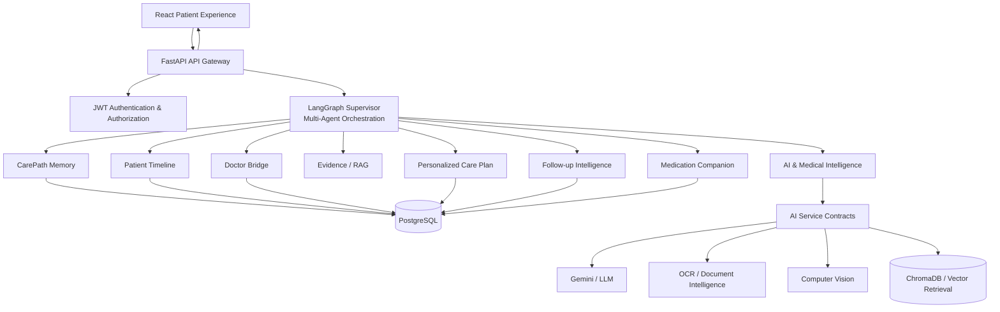
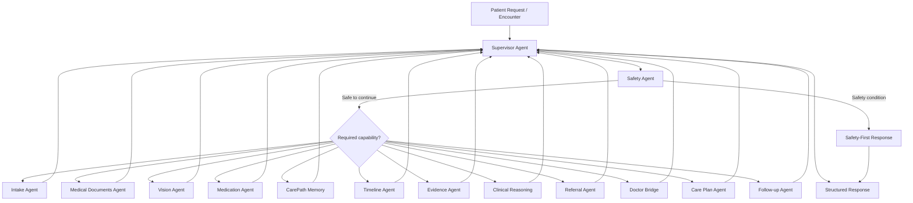

<div align="center">
  
  <h1>CarePath AI</h1>
  <p><b>AI-Powered Clinical Intelligence & Continuity-of-Care Platform</b></p>

  
  
  
  
  
  
  
</div>

<br />

<p align="center">
  <a href="#overview">Overview</a> ·
  <a href="#key-features">Key Features</a> ·
  <a href="#technology-stack">Tech Stack</a> ·
  <a href="#architecture">Architecture</a> ·
  <a href="#core-modules">Core Modules</a> ·
  <a href="#key-metrics">Key Project Metrics</a> ·
  <a href="#getting-started">Getting Started</a> ·
  <a href="#testing">Testing</a> ·
  <a href="#safety">Safety</a>
</p>

---

# 🧠 Overview

**CarePath AI** is an AI-powered clinical intelligence and continuity-of-care platform designed to help patients navigate complex healthcare journeys with greater clarity and continuity.

Instead of functioning as a conventional medical chatbot, CarePath AI combines **FastAPI, LangGraph-based multi-agent orchestration, medical document intelligence, evidence-backed retrieval, patient memory, timeline intelligence, specialist navigation, doctor interaction, personalized care planning, medication support, and follow-up intelligence** into a unified workflow.

The platform is designed around one core objective:

> **Help patients reach the right guidance, the right specialist, and the right next step at the right time.**

### The Core Problem

Healthcare information is often fragmented across:

- Symptoms and patient descriptions
- Medical reports and prescriptions
- Previous consultations
- Treatment history
- Medication information
- Test results
- Specialist referrals
- Follow-up interactions

As a result, patients may repeatedly explain their history, lose track of important information, undergo unnecessary delays, or struggle to understand what they should do next.

### The CarePath Approach

CarePath AI creates a continuous information flow:

```text
Patient Symptoms
       ↓
Medical Information
       ↓
AI Analysis
       ↓
Patient Context & Memory
       ↓
Evidence Retrieval
       ↓
Clinical Reasoning
       ↓
Specialist Navigation
       ↓
Doctor Interaction
       ↓
Personalized Care Plan
       ↓
Medication & Follow-up
       ↓
Continuous Care


<a id="overview"></a>

---

# ✨ Key Features

| Capability | What it enables |
| :--- | :--- |
| **AI-Powered Patient Intake** | Structures symptoms, patient context, history, and encounter information into a format that downstream agents can reason over. |
| **Smart Document Analyzer** | Processes uploaded medical documents and extracts structured information for use across the patient's healthcare journey. |
| **Medication Companion** | Extracts medication information from prescriptions, supports patient confirmation, and enables reminder and adherence workflows. |
| **Evidence-Backed Guidance** | Uses RAG-based evidence retrieval to provide supporting medical context and improve transparency behind AI-generated guidance. |
| **Explainable Specialist Referral** | Combines symptoms, history, treatment context, reasoning, and evidence to recommend the most appropriate specialist with an explainable rationale. |
| **CarePath Doctor Bridge** | Creates a doctor-ready patient brief, generates case-specific questions, and supports clinician review and feedback through a human-in-the-loop workflow. |
| **CarePath Memory** | Maintains relevant patient context across interactions so the system can provide continuity instead of treating every encounter as an isolated conversation. |
| **AI-Generated Patient Timeline** | Organizes symptoms, consultations, documents, prescriptions, referrals, care plans, and follow-ups into a chronological healthcare journey. |
| **Personalized Care Plan** | Converts relevant patient context and clinician-provided information into structured next steps, monitoring points, and follow-up guidance. |
| **Follow-up Intelligence** | Supports post-consultation check-ins, follow-up scheduling, treatment-response tracking, and escalation workflows when additional review is required. |
| **Safety-First Agent** | Evaluates configured safety signals and can interrupt the normal navigation workflow when a safety condition requires priority handling. |
| **Multi-Agent Orchestration** | Uses a LangGraph Supervisor to dynamically coordinate specialized agents instead of sending every request through a single monolithic AI workflow. |
| **Human-in-the-Loop Review** | Allows the workflow to pause for clinician review and resume with clinician-provided information incorporated into the patient context. |
| **SSE Workflow Streaming** | Streams long-running workflow progress such as agent execution, evidence retrieval, review requests, completion, and failure events to the frontend. |
| **Structured AI Service Contracts** | Decouples FastAPI and LangGraph from individual AI providers through reusable contracts for document analysis, vision, medication extraction, and evidence retrieval. |


---

# 💼 Technology Stack

| Layer | Technologies |
| :--- | :--- |
| **Frontend** | React 19, TypeScript, Vite, React Router |
| **User Experience** | Tailwind CSS 4, Lucide React, Recharts, Motion, React Markdown |
| **Backend API** | Python 3.13, FastAPI, Uvicorn, Pydantic |
| **Multi-Agent Orchestration** | LangGraph, LangChain Core, Supervisor-based agent routing |
| **AI & Language** | Google Gemini, structured AI service contracts, medical NLP workflows |
| **Document Intelligence** | OCR / document-analysis service contracts, EasyOCR integration |
| **Computer Vision** | PyTorch-based vision workflows and vision service contracts |
| **Evidence & RAG** | ChromaDB, vector retrieval, Evidence Agent |
| **Data Layer** | PostgreSQL, SQLAlchemy, AsyncPG, Alembic |
| **State & Persistence** | CarePath shared state, repository interfaces, LangGraph workflow state |
| **Real-Time Communication** | Server-Sent Events (SSE) |
| **Authentication** | JWT-based authentication, password hashing, role-aware access control |
| **Validation & Configuration** | Pydantic, Pydantic Settings |
| **Testing** | Pytest, pytest-asyncio, mocked AI service contracts, API and LangGraph tests |
| **Infrastructure** | Docker, environment-based configuration |
| **Logging & Observability** | Structured logging with Structlog |

---

# 🏗️ Architecture & Domain Deep-Dive

CarePath AI is organized into four tightly integrated operational domains.
Each domain owns a distinct responsibility in the patient healthcare journey
while communicating through well-defined API and service contracts.

> **The frontend presents the journey, the backend coordinates it,
> LangGraph orchestrates intelligence, and specialized services provide
> the evidence and context required for each workflow.**


---

## 🤖 1. Artificial Intelligence & Multi-Agent Intelligence Domain

> *The intelligence layer of CarePath AI. It transforms unstructured
> patient information into structured context, evidence, reasoning,
> navigation guidance, and actionable healthcare workflows.*

| Feature | Technical Breakdown & Capability |
| :--- | :--- |
| 🧠 **LangGraph Supervisor** | Acts as the central orchestrator and dynamically determines which specialized agent should execute next. |
| 🛡️ **Safety Agent** | Performs safety-first evaluation and can interrupt the normal navigation workflow when configured safety conditions require priority handling. |
| 📥 **Intake Agent** | Structures patient symptoms, encounter information, duration, severity, and relevant context. |
| 👁️ **Vision Agent** | Provides an abstraction for supported medical-image analysis through the Computer Vision service contract. |
| 📄 **Medical Documents Agent** | Processes document-analysis and OCR outputs and converts supported medical documents into structured information. |
| 💊 **Medication Agent** | Extracts medication information from prescription context and prepares structured data for confirmation and reminder workflows. |
| 📚 **Evidence Agent** | Retrieves relevant evidence through the RAG service contract and preserves source information for explainability. |
| 🧩 **Clinical Reasoning Agent** | Aggregates relevant patient context, timeline information, document findings, and evidence into structured reasoning. |
| 🩺 **Referral Agent** | Produces specialist-navigation guidance using available context, reasoning, evidence, confidence, and urgency information. |
| 📝 **Care Plan Agent** | Organizes relevant information into structured care-plan guidance while separating AI-generated guidance from clinician-provided instructions. |
| 🔔 **Follow-up Agent** | Coordinates post-consultation check-ins and follow-up workflows. |
| ⏸️ **Human-in-the-Loop** | Allows workflows such as the Doctor Bridge to pause, receive clinician input, and resume while preserving graph state. |

### Agent Orchestration




